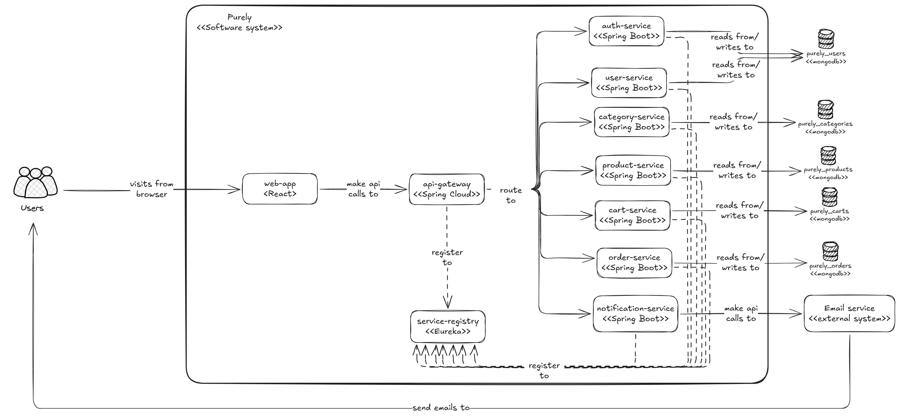
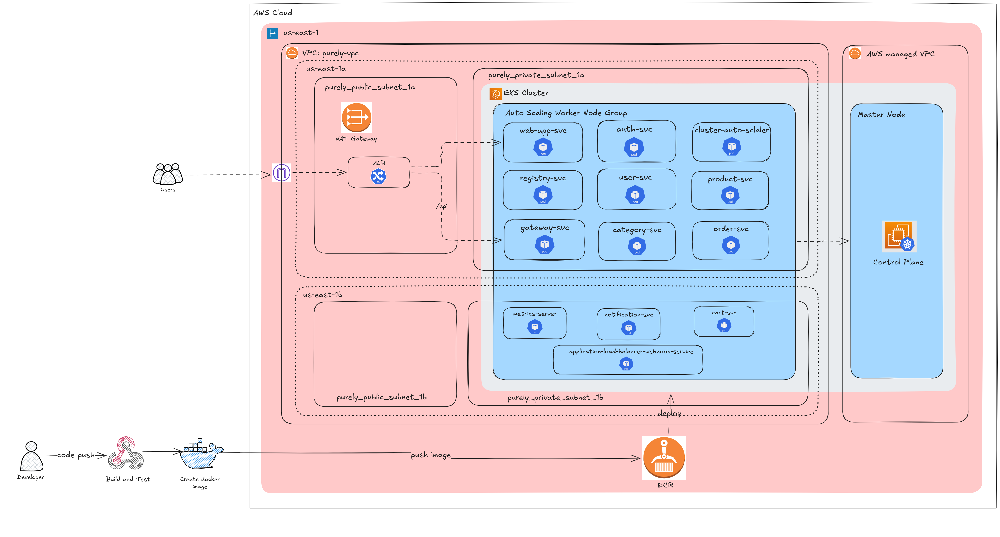

<h1 align="center">JNexus Commerce — Cloud-First Microservices E-Commerce Platform</h1>

<p align="center">
  <strong>Designed & Developed by Jathin Kumar Sahu</strong>
</p>

<p align="center">
  
  
  
  
  
  
  
  
  
  
</p>

- **JNexus Commerce** is a cloud-first microservices web application built for my college final project, showcasing modern cloud-native development with Kubernetes orchestration.
- The application is a full-stack e-commerce platform where users can browse products, add items to a cart, and complete purchases.
- The architecture leverages **Spring Boot microservices**, **Spring Cloud Gateway**, and **Eureka Service Registry**, with a **React.js frontend** and **MongoDB databases**.
- The solution is containerized and deployed to **AWS Elastic Kubernetes Service (EKS)** using **Helm** and automated via **GitHub Actions CI/CD** pipelines.

## Table of Contents

1. [Project Tree](#project-tree)
2. [Development Setup](#development-setup)
   - [Component Diagram](#component-diagram)
   - [Frontend](#frontend)
   - [Service Registry](#service-registry)
   - [API Gateway](#api-gateway)
   - [Auth Service](#auth-service)
   - [Category Service](#category-service)
   - [Product Service](#product-service)
   - [Cart Service](#cart-service)
   - [Order Service](#order-service)
   - [Notification Service](#notification-service)
3. [Deployment Setup](#deployment-setup)
   - [Deployment Diagram](#deployment-diagram)
   - [Containerization](#containerization)
   - [Kubernetes Orchestration](#kubernetes-orchestration)
   - [AWS Infrastructure](#aws-infrastructure)
   - [Terraform - Infrastructure as Code](#terraform---infrastructure-as-code)
   - [CI/CD with GitHub Actions](#cicd-with-github-actions)
4. [How to Run Locally](#how-to-run-locally)
5. [How to Deploy to AWS EKS](#how-to-deploy-to-aws-eks)

## Project Tree

```
jnexus-commerce/
├── .github/
│   └── workflows/
│       ├── ci-cd-auth.yml
│       ├── ci-cd-cart.yml
│       ├── ci-cd-category.yml
│       ├── ci-cd-gateway.yml
│       ├── ci-cd-ingress.yml
│       ├── ci-cd-notification.yml
│       ├── ci-cd-order.yml
│       ├── ci-cd-product.yml
│       ├── ci-cd-registry.yml
│       ├── ci-cd-user.yml
│       └── ci-cd-web.yml
├── frontend/
├── helm-charts/
├── microservice-backend/
│   ├── js-api-gateway/
│   ├── js-auth-service/
│   ├── js-cart-service/
│   ├── js-category-service/
│   ├── js-notification-service/
│   ├── js-order-service/
│   ├── js-product-service/
│   ├── js-service-registry/
│   └── js-user-service/
├── sample-data/
│   ├── js_category_service.categories.json
│   └── js_product_service.products.json
└── terraform/
```

## Development Setup

- **Microservices Architecture**: Independent services for User, Auth, Product, Category, Cart, Order, and Notification.
- **Service Discovery**: Centralized Eureka Service Registry manages dynamic discovery of microservices within the cluster.
- **API Gateway**: Built using Spring Cloud Gateway. Acts as the single entry point for all client requests.
- **Frontend**: Developed in React.js with a Deep Purple (`#6c5ce7`) theme. Communicates with the backend via API Gateway.
- **Databases**: Each microservice uses a dedicated MongoDB database.
- **API Documentation**: Swagger/OpenAPI available at `/swagger-ui.html` on each service.

### Component Diagram



### Frontend

React.js SPA at `frontend/` with Vite. Brand name: **JS Premium**. Primary theme color: `#6c5ce7` (Deep Purple).

### Service Registry

The [Service Registry](./microservice-backend/service-registry) serves as a centralized Eureka server for storing information about all available microservices (IP, ports, metadata).

### API Gateway

The [API Gateway](./microservice-backend/api-gateway) acts as the single entry point, routing requests to the correct microservice via Eureka service discovery.

### Auth Service

The [Auth Service](./microservice-backend/auth-service) handles user identity verification and JWT-based authentication.

| HTTP Method | Route | Description |
|---|---|---|
| POST | `/auth/signin` | User login |
| POST | `/auth/signup` | User registration |
| GET | `/auth/signup/verify` | Validate OTP code |
| GET | `/auth/signup/resend` | Resend OTP code |
| GET | `/auth/isValidToken` | Validate JWT token |

### Category Service

The [Category Service](./microservice-backend/category-service) provides CRUD operations for product categories.

| HTTP Method | Route | Description | Auth | Role |
|---|---|---|---|---|
| POST | `/admin/category/create` | Create category | Yes | Admin |
| PUT | `/admin/category/edit` | Edit category | Yes | Admin |
| DELETE | `/admin/category/delete` | Delete category | Yes | Admin |
| GET | `/category/get/all` | Get all categories | No | Any |
| GET | `/category/get/byId` | Get category by ID | No | Any |

### Product Service

The [Product Service](./microservice-backend/product-service) manages the product catalog.

| HTTP Method | Route | Description | Auth | Role |
|---|---|---|---|---|
| POST | `/admin/product/add` | Add product | Yes | Admin |
| PUT | `/admin/product/edit` | Edit product | Yes | Admin |
| GET | `/product/get/all` | Get all products | No | Any |
| GET | `/product/get/byId` | Get product by ID | No | Any |
| GET | `/product/get/byCategory` | Filter by category | No | Any |
| GET | `/product/search` | Search products | No | Any |

### Cart Service

The [Cart Service](./microservice-backend/cart-service) manages shopping carts.

| HTTP Method | Route | Description | Auth |
|---|---|---|---|
| POST | `/cart/add` | Add item / update quantity | Yes |
| GET | `/cart/get/byUser` | Get cart by user | Yes |
| GET | `/cart/get/byId` | Get cart by ID | Yes |
| DELETE | `/cart/remove` | Remove item | Yes |
| DELETE | `/cart/clear/byId` | Clear entire cart | Yes |

### Order Service

The [Order Service](./microservice-backend/order-service) handles order lifecycle.

| HTTP Method | Route | Description | Auth | Role |
|---|---|---|---|---|
| POST | `/order/create` | Place order | Yes | User |
| GET | `/order/get/byUser` | Get user orders | Yes | User |
| GET | `/order/get/all` | Get all orders | Yes | Admin |
| DELETE | `/order/cancel` | Cancel order | Yes | User |

### Notification Service

The [Notification Service](./microservice-backend/notification-service) sends transactional emails.

| HTTP Method | Route | Description |
|---|---|---|
| POST | `/notification/send` | Send email |

## Deployment Setup

### Deployment Diagram



### Containerization

Each component has its own `Dockerfile`. Images are pushed to **Amazon ECR**.

### Kubernetes Orchestration

Each service is deployed as a Helm chart under [`/helm-charts`](./helm-charts). Each chart includes `Deployment`, `HPA`, `Service`, `ConfigMaps`, and `Secrets`.

### AWS Infrastructure

#### Networking (AWS VPC)

- Dedicated VPC across 2 Availability Zones
- 2 Public subnets + 2 Private subnets
- Internet Gateway for public subnet access
- NAT Gateway for private subnet outbound traffic

#### Kubernetes Cluster (AWS EKS)

- EKS cluster: `js-commerce-cluster`
- Managed Node Groups across 2 AZs in private subnets
- Application Load Balancer Controller for Ingress routing
- Metrics Server for HPA
- Cluster Autoscaler for automatic node scaling

### Terraform - Infrastructure as Code

```bash
terraform init
terraform plan
terraform apply
```

After apply, update kubeconfig:

```bash
aws eks update-kubeconfig --region YOUR_REGION --name js-commerce-cluster
```

### CI/CD with GitHub Actions

Separate workflow file per service. Each workflow:
1. Builds & tests the service
2. Builds Docker image and pushes to ECR
3. Deploys/updates Helm release on EKS

## How to Run Locally

### Prerequisites

- JDK 21
- Maven
- Node.js 18+
- npm
- MongoDB Atlas account

### Step 1: Clone Repository

```bash
git clone https://github.com/<your-username>/jnexus-commerce
cd jnexus-commerce
```

### Step 2: Setup MongoDB Databases

Create in MongoDB Atlas:
- `js_auth_service`
- `js_category_service`
- `js_product_service`
- `js_cart_service`
- `js_order_service`

Import sample data from `sample-data/` directory.

### Step 3: Configure Email (Notification Service)

Edit `microservice-backend/notification-service/src/main/resources/application.properties`:

```properties
spring.mail.username=YOUR_EMAIL
spring.mail.password=YOUR_APP_PASSWORD
```

### Step 4: Run Backend Services

Start in this order:

```bash
# 1. Service Registry (Eureka)
cd microservice-backend/service-registry && mvn spring-boot:run

# 2. API Gateway
cd microservice-backend/api-gateway && mvn spring-boot:run

# 3. All other services (each in its own terminal)
cd microservice-backend/auth-service && mvn spring-boot:run
cd microservice-backend/user-service && mvn spring-boot:run
cd microservice-backend/category-service && mvn spring-boot:run
cd microservice-backend/product-service && mvn spring-boot:run
cd microservice-backend/cart-service && mvn spring-boot:run
cd microservice-backend/order-service && mvn spring-boot:run
cd microservice-backend/notification-service && mvn spring-boot:run
```

Verify all services are registered at [http://localhost:8761](http://localhost:8761).

### Step 5: Run Frontend

```bash
cd frontend
npm install
npm run dev
```

Update `frontend/src/api-service/apiConfig.jsx` for local development:

```js
const API_BASE_URL = "http://localhost:8080"
```

Access the app at [http://localhost:5173](http://localhost:5173).

## How to Deploy to AWS EKS

### Prerequisites

- kubectl
- Helm
- AWS CLI
- eksctl
- Terraform

### Step 1: Provision AWS Infrastructure

```bash
cd terraform
terraform init
terraform plan
terraform apply
aws eks update-kubeconfig --region YOUR_REGION --name js-commerce-cluster
```

### Step 2: Configure GitHub Actions Secrets

| Secret | Value |
|---|---|
| `AWS_ACCESS_KEY_ID` | IAM user access key |
| `AWS_REGION` | `us-east-1` |
| `AWS_SECRET_ACCESS_KEY` | IAM user secret key |
| `ECR_AUTH_REPOSITORY` | `js_auth_registry` |
| `ECR_CART_REPOSITORY` | `js_cart_registry` |
| `ECR_CATEGORY_REPOSITORY` | `js_category_registry` |
| `ECR_GATEWAY_REPOSITORY` | `js_gateway_registry` |
| `ECR_NOTIFICATION_REPOSITORY` | `js_notification_registry` |
| `ECR_ORDER_REPOSITORY` | `js_order_registry` |
| `ECR_PRODUCT_REPOSITORY` | `js_product_registry` |
| `ECR_REGISTRY_REPOSITORY` | `js_service_registry` |
| `ECR_USER_REPOSITORY` | `js_user_registry` |
| `ECR_WEB_REPOSITORY` | `js_web_registry` |
| `EKS_CLUSTER` | `js-commerce-cluster` |
| `SPRING_DATA_MONGODB_URI_AUTH` | MongoDB Atlas URI for auth service |
| `SPRING_DATA_MONGODB_URI_CART` | MongoDB Atlas URI for cart service |
| `SPRING_DATA_MONGODB_URI_CATEGORY` | MongoDB Atlas URI for category service |
| `SPRING_DATA_MONGODB_URI_ORDER` | MongoDB Atlas URI for order service |
| `SPRING_DATA_MONGODB_URI_PRODUCT` | MongoDB Atlas URI for product service |
| `SPRING_MAIL_PASSWORD` | Email app password |
| `SPRING_MAIL_USERNAME` | Email address |

### Step 3: Trigger CI/CD

Push to the repository. GitHub Actions will automatically build, push Docker images to ECR, and deploy Helm charts to EKS.

---

*JNexus Commerce — Built with passion by Jathin Kumar Sahu | Version 2.0.1-STABLE*
